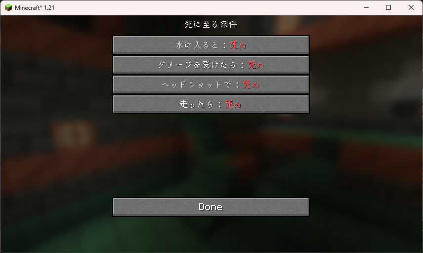

# ソウルライクな死

まるでソウルライクゲームのようなプレイ感を演出します🧙
いろいろな**厳しい条件**を設定して、生き延びよう😉

# インストール方法

* 依存するmodをインストールしてください
* その後、本modをインストールください

## 依存する環境のセットアップ

1. Fabricローダーをインストールしてください。参照👉👉https://fabricmc.net/use/installer/
1. 以下のmodをインストールしておいてください
   1. [Fabric API](https://modrinth.com/mod/fabric-api)
   1. [Mod Menu](https://modrinth.com/mod/modmenu)
   1. [Cloth Config API](https://modrinth.com/mod/cloth-config)

## modのインストール

公開しているページからバージョンにあったmodをダウンロードして、インストールしてください👉👉👉 [Modrinth Soulslike Deaths](https://modrinth.com/mod/soulslike-deaths/versions)

# 使い方

* ModMenuのメニューを通じて設定が可能です
* 

# 設定できる項目

- 水に入ったら💀
- いかなるダメージを受けても💀
- ヘッドショット💀
- 走ったら💀

良いマインクラフトを！ 😉
