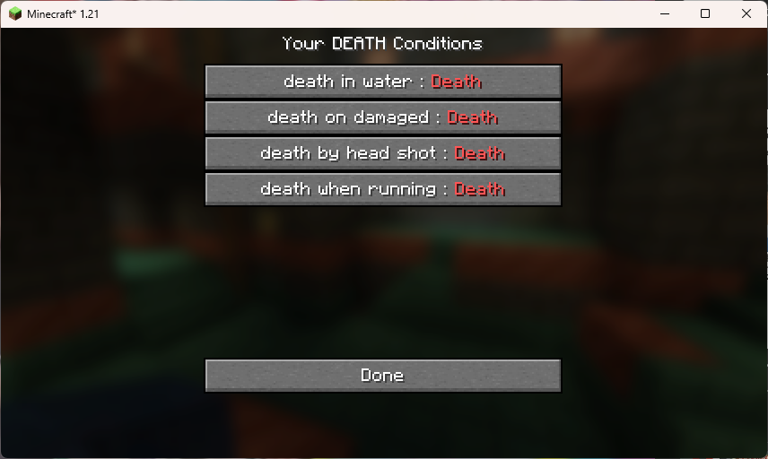

# Soulslike Deaths

[日本語の説明はこちら](./README.ja.md)

Soulslike Deaths enforce you to set extremely condition for death 💀
You can play super hard Minecraft 🧙

# install

* install dependencies 1st.
* next, install this mod.

## setup dependencies

1. setup fabric environment. vist to https://fabricmc.net/use/installer/
1. install following mods
   1. [Fabric API](https://modrinth.com/mod/fabric-api)
   1. [Mod Menu](https://modrinth.com/mod/modmenu)
   1. [Cloth Config API](https://modrinth.com/mod/cloth-config)

## install mod

please download published .jar from [Modrinth Soulslike Deaths](https://modrinth.com/mod/soulslike-deaths/versions)

# how to use

* set death conditions by ModMenu !
* 

Please Enjoy 😉
